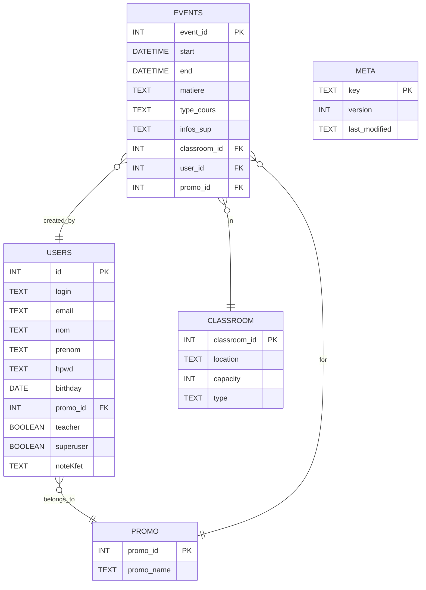
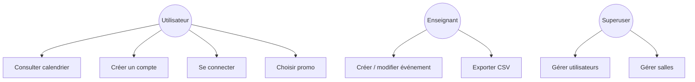
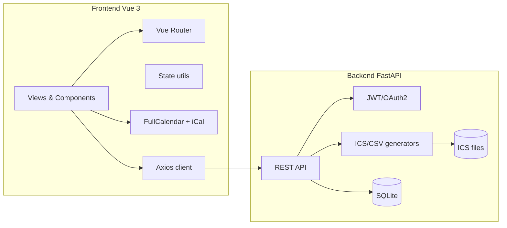
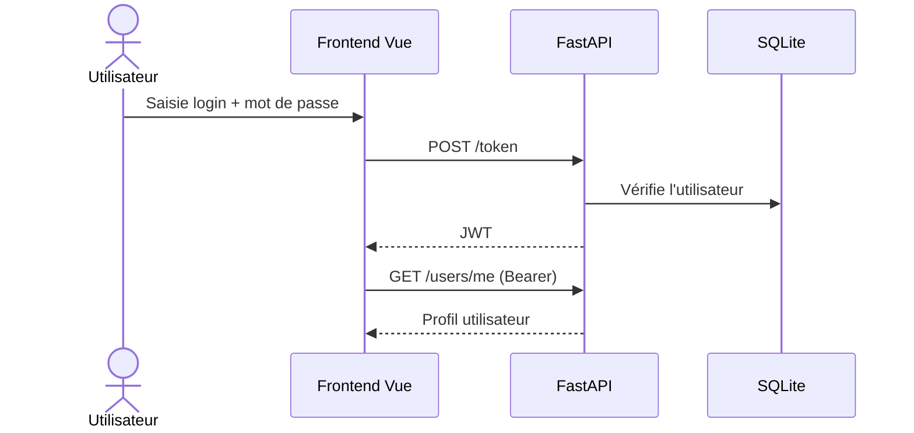
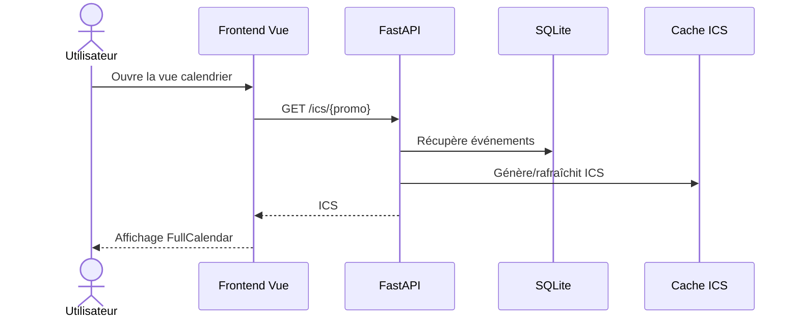
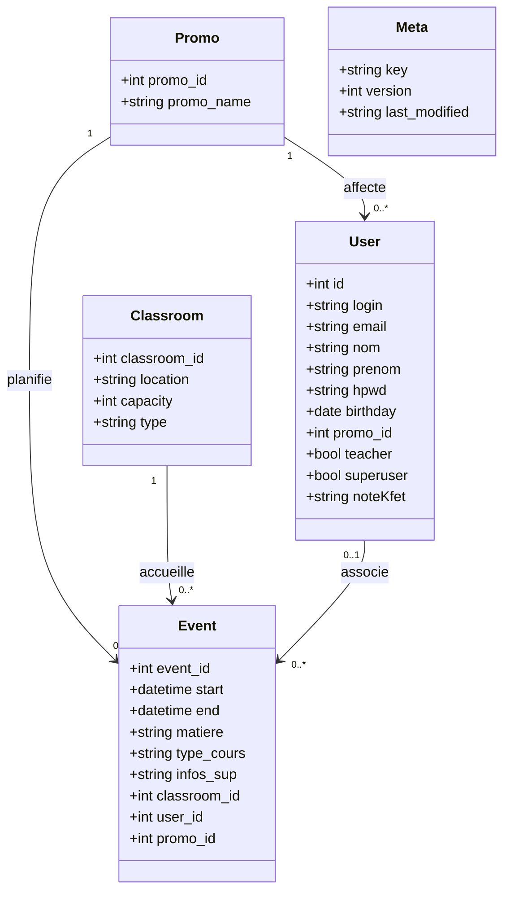

# Cahier des charges – Projet CAFE 2.0

## 1. Objet du document
Ce cahier des charges décrit de manière détaillée le projet CAFE 2.0, une application web de gestion d’agendas académiques pour l’ENS. Il formalise les objectifs, le périmètre, l’architecture, les exigences fonctionnelles et non fonctionnelles, ainsi que la structure des données et l’API.

## 2. Contexte et vision
CAFE 2.0 est une plateforme interne destinée aux étudiants, enseignants et personnels de l’ENS afin de consulter et administrer des calendriers académiques. La solution doit être moderne, rapide, simple d’usage et proposer une base technique saine pour évoluer (ajout de nouveaux calendriers, gestion de rôles, exports, etc.).

## 3. Objectifs
- Centraliser la consultation d’emplois du temps académiques (par promo, salle, etc.).
- Proposer une authentification sécurisée (JWT) pour accéder aux fonctions privées.
- Offrir une interface responsive avec navigation mensuelle/hebdo/journalière.
- Permettre l’administration des comptes et des événements selon les rôles.
- Fournir des exports ICS et CSV pour l’interopérabilité.

## 4. Périmètre fonctionnel
### 4.1 Inclus
- Frontend Vue 3 (pages publiques, authentification, calendrier, admin).
- Backend FastAPI (auth, gestion des comptes, événements, salles, promos).
- Base de données SQLite (stockage comptes et événements).
- Génération et diffusion de calendriers ICS + export CSV.
- Gestion des droits (utilisateur, enseignant, superuser).

### 4.2 Exclu
- Synchronisation temps réel multi-sources (webhooks, push).
- Notifications avancées (push, mail automatisé).
- Gestion d’autorisations métiers très fines (au-delà des rôles de base).
- Intégrations SSO/LDAP institutionnelles (à prévoir en évolution).

## 5. Parties prenantes et rôles
### 5.1 Rôles utilisateurs
- **Utilisateur** : consultation des calendriers, choix de promo, profil.
- **Enseignant** : création/modification d’événements, gestion calendrier.
- **Superuser** : gestion comptes, rôles, salles, suppression d’utilisateurs.

### 5.2 Parties prenantes
- Étudiants et enseignants (utilisateurs finaux).
- Équipe pédagogique (validation fonctionnelle).
- Équipe technique (maintenance et évolution).

## 6. Architecture générale
- **Frontend** : Vue 3 + Vite + TypeScript + Vuetify, FullCalendar.
- **Backend** : FastAPI, JWT, SQLite, génération ICS/CSV.
- **Flux** : l’UI consomme l’API REST, l’API accède à la base SQLite et génère des fichiers ICS/CSV.
- **Stockage local** : ICS générés sur le filesystem, mise en cache via table `meta`.

## 7. Frontend (Vue 3)
### 7.1 Stack
- Vue 3 + Composition API + `<script setup>`.
- TypeScript.
- Vuetify pour l’UI.
- FullCalendar + plugin iCalendar.
- Axios (client centralisé).
- Vue Router.
- Pinia (présent mais peu utilisé, état principalement via `src/utils.ts`).

### 7.2 Organisation du code
- `src/views/` : pages (Home, Calendar, Login, Register, UserDetail, Superuser, Su_cal, Su_people, Su_room, Contact, Kawa, Stage, NotFound).
- `src/components/` : composants UI (Calendar, Event modals, Promo/Classroom selects, Sidebar, etc.).
- `src/api/index.ts` : client Axios + fonctions d’appel API.
- `src/router/index.ts` : routing + guards.
- `src/utils.ts` : état simple d’authentification + helpers.
- `src/utils/authEvents.ts` : events cross-app (auth, profil).

### 7.3 Routes principales
| Route | Vue | Accès | Description |
| --- | --- | --- | --- |
| `/` | `Home.vue` | Public | Accueil + présentation du service |
| `/calendar` | `Calendar.vue` | Auth | Calendrier de la promo de l’utilisateur |
| `/contact` | `Contact.vue` | Public | Contact |
| `/kawa` | `Kawa.vue` | Auth | Page interne “Machine à café” |
| `/stage` | `Stage.vue` | Auth | Page stage |
| `/register` | `Register.vue` | Public | Création de compte |
| `/login` | `Login.vue` | Public | Connexion |
| `/users/:id` | `UserDetail.vue` | Auth | Profil utilisateur |
| `/superuser` | `Superuser.vue` | Teacher/SU | Hub administrateur |
| `/su_people` | `Su_people.vue` | SU | Gestion utilisateurs |
| `/su_cal` | `Su_cal.vue` | Teacher/SU | Gestion calendriers + export CSV |
| `/su_room` | `Su_room.vue` | Teacher/SU | Gestion salles |
| `*` | `NotFound.vue` | Public | 404 |

### 7.4 Composants clés
- `Calendar_compo.vue` : affichage calendrier étudiant via FullCalendar (lecture).  
- `Calendar_compo_SU.vue` : calendrier admin + ajout/modification/suppression d’événements.
- `event_add.vue` / `event_modif.vue` : formulaires d’événements.
- `PromoSelect.vue` / `ClassroomSelect.vue` : sélection de promo/salle.
- `UserRoleList.vue` : gestion des rôles (professeurs/élèves/superusers).
- `SubCalendar.vue` : choix de promo préférée (profil).

### 7.5 Authentification et rôle côté UI
- Stockage du JWT dans `localStorage` (`cafe_token`).
- Flag `cafe_superuser` pour faciliter l’UI.
- `router.beforeEach` vérifie les rôles via `/users/me`.
- Helpers `isConnected`, `isSuperuser`, `isTeacher` dans `src/utils.ts`.

### 7.6 Calendrier & intégration ICS
- FullCalendar (views mois/semaine/jour/liste).
- Chargement d’un flux ICS via `/ics/{promo}` (converti en `blob` pour FullCalendar).
- Bouton d’abonnement externe via `add-to-calendar-button`.

## 8. Backend (FastAPI)
### 8.1 Stack
- FastAPI (API REST).
- JWT (OAuth2 password flow).
- SQLite (stockage).
- `icalendar` pour génération ICS.
- `pandas` pour génération CSV.

### 8.2 Structure backend
- `backend/server.py` : création de l’app, CORS, routes globales.
- `backend/routers/users.py` : gestion comptes + droits.
- `backend/routers/ics.py` : gestion calendrier, événements, salles.
- `backend/routers/app_stats.py` : healthcheck.
- `backend/dependancies.py` : JWT, hash, auth helpers.
- `backend/db_webcafe.py` : accès SQLite, création tables, triggers.

### 8.3 Authentification
- Endpoint OAuth2 `/token` avec `OAuth2PasswordRequestForm`.
- JWT signé (HS256) avec durée de 30 minutes.
- Auth Bearer sur les routes privées (`Authorization: Bearer <token>`).

### 8.4 Gestion des calendriers
- Génération d’ICS filtrés (par promo, salle, etc.).
- Cache de génération via table `meta` (versionnement par trigger SQL).
- Endpoints dynamiques `/ics/{promo}` créés au démarrage.

### 8.5 Gestion des utilisateurs
- Création, lecture du profil, modification des champs autorisés.
- Gestion des droits prof/superuser.
- Liste complète des utilisateurs pour superusers.

### 8.6 Gestion des salles
- Liste, insertion, suppression de salles (enseignant/superuser).

## 9. API REST
### 9.1 Base d’URL
- L’API FastAPI est montée avec `root_path="/api"`.
- Le frontend attend `VITE_API_BASE` (par défaut `/api/v1`) : à aligner en environnement.

### 9.2 Endpoints (backend `main`)
| Méthode | Endpoint | Auth | Entrée | Réponse / Notes |
| --- | --- | --- | --- | --- |
| GET | `/` | Non | — | Message de bienvenue + création routes dynamiques |
| GET | `/version` | Non | — | `{ version: "2.0.0" }` |
| GET | `/status/healthcheck` | Non | — | `{ status: "ok" }` |
| POST | `/token` | Non | `x-www-form-urlencoded` | JWT (`access_token`, `token_type`) |
| GET | `/users/me` | Oui | Bearer | Profil utilisateur |
| POST | `/users/create` | Non | JSON `User` | Création utilisateur |
| POST | `/users/modify` | Oui | JSON partiel | Mise à jour profil |
| GET | `/users/all` | Oui (SU) | — | Liste complète utilisateurs |
| POST | `/users/set/teacher` | Oui (SU) | `teacher_login` | Promotion prof |
| POST | `/users/remove/teacher` | Oui (SU) | `teacher_login` | Révocation prof |
| POST | `/users/delete` | Oui (SU) | `user_login` | Suppression utilisateur |
| GET | `/calendars/available` | Non | — | Liste des promos disponibles |
| GET | `/classrooms/all` | Non | — | Liste des salles |
| GET | `/classrooms/all/detail` | Non | — | Détails des salles |
| GET | `/ics/testICS` | Non | — | ICS de test |
| GET | `/ics/generated_test` | Non | — | ICS généré (test) |
| GET | `/ics/get_all` | Non | — | ICS global (cache) |
| GET | `/ics/{promo}` | Non | — | ICS dynamique par promo |
| POST | `/ics/insert` | Oui (Teacher/SU) | JSON `NewEvent` | Ajout événement |
| GET | `/ics/delete` | Oui (Teacher/SU) | `uid_str` | Suppression événement |
| GET | `/ics/event_filter` | Non | Query `Event` | Filtrage événements |
| POST | `/ics/insert_classroom` | Oui (Teacher/SU) | JSON `Classroom` | Ajout salle |
| POST | `/ics/delete_classroom` | Oui (Teacher/SU) | `location` | Suppression salle |
| GET | `/csv` | Non | `promo_str` | Fichier CSV pour promo |

## 10. Données & modèle
### 10.1 Tables principales
| Table | Champs clés | Description |
| --- | --- | --- |
| `users` | `id`, `login`, `email`, `hpwd`, `promo_id`, `teacher`, `superuser` | Comptes utilisateurs, droits et promo |
| `events` | `event_id`, `start`, `end`, `matiere`, `type_cours`, `promo_id`, `classroom_id` | Événements calendaires |
| `classroom` | `classroom_id`, `location`, `capacity`, `type` | Salles |
| `promo` | `promo_id`, `promo_name` | Promotions disponibles |
| `meta` | `key`, `version`, `last_modified` | Versionnement (cache ICS) |

### 10.2 Règles de gestion
- Un événement est unique pour un couple (`start`, `promo_id`).
- Les promos sont stockées en base et exposées via `/calendars/available`.
- Le cache ICS est invalidé via triggers SQL sur `events`.

### 10.3 ERD (Mermaid)

## 11. Flux fonctionnels clés
- **Inscription** : formulaire frontend → `/users/create` → compte créé.
- **Connexion** : formulaire frontend → `/token` → stockage JWT → `/users/me`.
- **Consultation calendrier** : `/ics/{promo}` → ICS converti → FullCalendar.
- **Administration utilisateurs** : `/users/all`, `/users/set/teacher`, `/users/delete`.
- **Administration calendriers** : `/ics/insert`, `/ics/delete` (+ rafraîchissement frontend).
- **Gestion salles** : `/classrooms/all`, `/ics/insert_classroom`, `/ics/delete_classroom`.
- **Export CSV** : `/csv?promo_str=...`.

## 12. Exigences non fonctionnelles
- **Sécurité** : JWT + hashing des mots de passe, validation Pydantic.
- **Performance** : réponse < 1s pour requêtes standard, cache ICS.
- **Fiabilité** : erreurs explicites, HTTP 4xx/5xx.
- **Portabilité** : exécution locale, Linux.
- **Qualité** : lint, tests unitaires (Vitest) et E2E (Playwright).

## 13. Tests & qualité
- Unit tests : `npm run test:unit` (Vitest).
- E2E : `npm run test:e2e` (Playwright).
- Lint : `npm run lint`.
- Formatage : `npm run format`.

## 14. Critères d’acceptation
- Inscription et connexion fonctionnelles (HTTP 201/200).
- `/users/me` retourne un profil valide pour un JWT valide.
- Le calendrier s’affiche avec événements (ICS) et supporte le rafraîchissement.
- Un enseignant peut créer/modifier/supprimer un événement.
- Un superuser peut gérer les utilisateurs et les salles.
- Les erreurs serveur renvoient des messages explicites.

## 15. UML (Mermaid)
### 15.1 Cas d’usage

### 15.2 Diagramme de composants

### 15.3 Séquence – Authentification

### 15.4 Séquence – Consultation d’un calendrier

### 15.5 Diagramme de classes (domaine)

## 16. Évolutions possibles
- Gestion avancée des rôles (hiérarchie, permissions fines).
- Import automatique des calendriers institutionnels.
- Notifications (email/push).
- Authentification SSO/LDAP.
- Historique des modifications d’événements.
